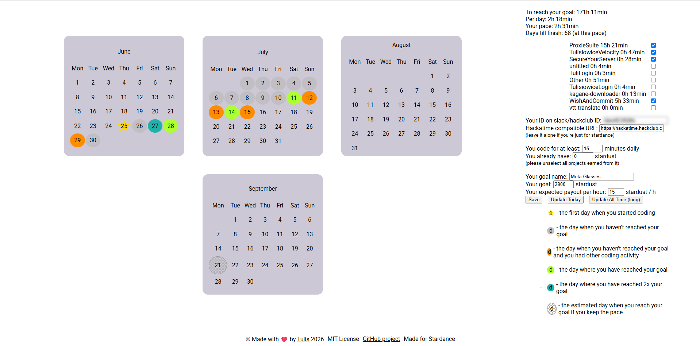

  

# WishAndCommit

## Make a wish for Stardance and commit to it!

- [x] Automatically fetches data from Hackatime using only your user ID/slack ID
- [x] Calculates your pace and whether you are able to achieve your goal (and what you need to change)
- [x] Calculates how many hours per day you need to code to reach your goal
- [x] Fully configurable: goal, estimated Stardust, minimum coding time per day
- [x] Works fully in browser and you can run it 100% locally
- [x] You can select projects that are for Stardance

  

# Usage

You can use it directly from GitHub Pages: https://tulis12.github.io/WishAndCommit or use it locally (literally just download the file and open in browser!)

Insert your slack ID/user ID and click `Save`. Wait for a bit as you see the progress on fetching the data. When it finished the site will reload showing your projects. Select those that are for Stardance and input your goal!

# Where can I get my ID?

Visit https://auth.hackclub.com and click your avatar in bottom-left corner of the screen (the user ID will be copied to clipboard)

# License

The project is under MIT License.
